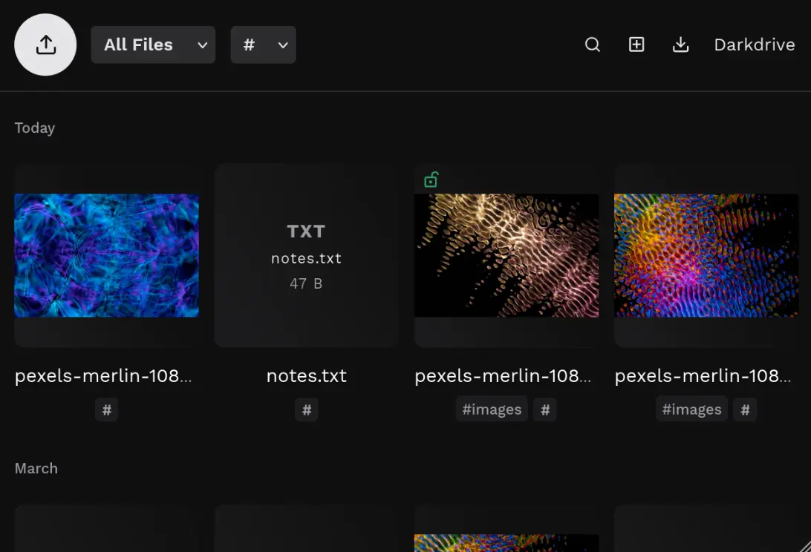

# Darkdrive


**Your Private Cloud. Securely Encrypted.**

A lean, security-first alternative to heavyweight self-hosted clouds. Store your files — personal or work — fully encrypted with AES-256-GCM and a client-side split-key architecture. No build step, no dependencies: a single-entry PHP app you drop on a server. Developed and operated in Germany.

[darkdrive.de](https://darkdrive.de) © 2026 [plue GmbH](https://plue.tech)



---

## Features

- **Encrypted at rest** — AES-256-GCM for file contents, filenames, tags, and thumbnails
- **Split-key architecture** — your password is never stored; the session-split cookie design resists backup, session, and cookie theft
- **Media streaming** — chunked storage with HTTP range support; play audio and video straight from the gallery
- **Thumbnails for everything** — images, videos, PDFs, and office documents, generated then stored encrypted
- **Tags** — organize files with encrypted tag directories
- **In-browser text editing** — edit files without downloading them
- **S3-compatible storage** — offload encrypted blobs to Hetzner, AWS S3, and others; keys never leave your server
- **Share to upload** — installed as a PWA on Chromium/Android, Darkdrive appears in your phone's share sheet
- **Duplicate detection** — re-sharing an album skips what is already stored, without re-uploading it
- **Two-way sync** — the Darksync client keeps a local folder in step
- **Signed auto-updates** — minisign / Ed25519 verified before every install
- **Zero build, zero dependencies** — single-entry PHP 8.1+ app; upload and go

---

## Security

Your files are protected by strong encryption at rest and in transit, but since the server handles your password during login and briefly sees decrypted data during uploads, a compromised or malicious server could intercept your data.

Darkdrive protects against stolen backups, session hijacking, brute-force attacks, and cookie theft, but not against someone who controls the server itself. This is inherent to any architecture that performs server-side decryption.

Always run Darkdrive behind HTTPS — your password travels to the server at login, and only TLS protects it in transit. And set your password immediately after installing: a fresh instance is claimed by whoever opens it first (see [Installation](#installation)).

**Encryption details:**

- File contents: AES-256-GCM, chunked streaming (16 MB chunks)
- Filenames: AES-256-GCM per filename
- Tags: AES-256-GCM encrypted directory names
- Thumbnails: generated from decrypted data, stored encrypted
- Password storage: `SPLITKEY:` bcrypt of the derived auth key
- Duplicate index: content fingerprints stored as HMAC-SHA256 under a key derived from your encryption key, so the index reveals nothing about what you store

---

## Installation

To try it locally first, run a dev server from the project root: `php -S localhost:8000 -d post_max_size=2G -d upload_max_filesize=2G`

To deploy:

**1.** Before uploading, move the data directory outside the web root by defining `DARKDRIVE_STORAGE_DIR` in `index.php`:

```php
define('DARKDRIVE_STORAGE_DIR', '/home/my_data');
```

With the directory outside the web root, no URL can ever reach your encrypted files or the password hash — on any web server. Setting this first means the app writes straight to its final location and never creates a `data/` inside the web root. Without it, data lives in `data/` inside the web root:

- **Apache** — still protected: Darkdrive writes a `Deny from all` `.htaccess` into `data/` automatically
- **nginx** — **not protected**: nginx ignores `.htaccess`, so you must either set `DARKDRIVE_STORAGE_DIR` (recommended) or block the directory in your server config — `data/` contains the password hash, and leaving it reachable enables offline brute-force attacks:

  ```nginx
  location ^~ /data/ { deny all; }
  ```

**2.** Upload all files to your web server with PHP 8.1+ and open the URL

**3.** Set a password on first visit. **Write it down.** It is the only way to decrypt your files — there is no recovery. **Do this immediately:** a fresh instance is claimed by whoever opens it first, so never leave an unconfigured install publicly reachable before you have set your password. If someone else claims it first, delete the installation and redo it under a different domain

You can customize further instance configuration in `index.php`

---

## Object Storage

Darkdrive supports S3-compatible object storage (Hetzner Buckets, AWS S3, etc.) for new file uploads.  
Enable S3 by uncommenting and filling in the constants in `index.php`.

Files stored on S3 are tracked by small `.s3` marker files in `data/files/`. The S3 provider only ever sees encrypted blobs — filenames, content, and encryption keys never leave your server.

Thumbnails are generated and stored locally for all files, including S3 files. If you disable S3 after uploading files to it, those files become temporarily unavailable (503) until S3 is re-enabled or the marker files are removed

---

## Emergency Password Change

If you need to change your password, Darkdrive provides a full re-encryption mode that decrypts and re-encrypts every file, filename, and tag with the new key.

**1.** Enable emergency mode by setting the constant `DARKDRIVE_EMERGENCY_PASSWORD` to `true` in `index.php`

**2.** Open `/emergency` in your browser. A new password will be generated for you — write it down

**3.** Enter your current password and click **Re-encrypt** to validate and re-encrypt all files, filenames and tags

**4.** After completion you will be logged out automatically. **Immediately** disable emergency mode by removing the `DARKDRIVE_EMERGENCY_PASSWORD` constant

---

## Darksync

> **Beta.** Darksync is a Python client so far tested only on Fedora Asahi with GNOME. It should run on any Linux desktop with Python 3, but treat other platforms as untested — reports and PRs for more environments are welcome.

There is a two-way sync client. Downloads new/changed files read-only, trashes deleted files locally, and uploads files dropped into `uploads/`. 

Clone the repository and run the installer from it — the client code is delivered and audited via the version-controlled repo, never piped from a server:

```
git clone https://github.com/plue-gmbh/darkdrive.de.git
cd darkdrive.de
./darksync.sh
```

Re-run `git pull && ./darksync.sh` to update. Running from the clone installs the `darksync.py` that ships in the repo, so no executable code is fetched over the network.

---

## Roadmap

- **Mobile app** — automatic photo upload from your phone
- **Shared-files overview** — one place to see everything you've shared publicly
- **Sortable grids** — order by date, name, size, and more
- **Calendar** — render a full calendar view and streamline ICS event editing
- **Contacts** — smoother contact editing
- **Internationalization** — multi-language UI
- **File metadata** — surface capture and creation dates (on upload, and later for JPEG/TIFF/video)
- **Editable filenames** — rename in place (a deeper change than it sounds)
- **Folder sync mode** — mirror a local folder structure

---

## Contributing

Pull requests welcome. Sign off your commits with `git commit -s` (Developer Certificate of Origin), and run the test suite before pushing: `php test.php` from the project root.

A few intentional design choices that may surprise newcomers: no Composer, no namespaces — Darkdrive is a single-entry PHP app, `index.php` boots `components/app.class.php` with manual `require_once`. No JS/CSS build step — `components/app.js` and `components/app.css` ship as-is. 2-space indent, see `.editorconfig`.

For larger changes, open an issue first to confirm direction.

By contributing, you agree your work is licensed under AGPLv3 and may be relicensed by plue GmbH under its commercial terms.

---

## Reporting Issues

For security vulnerabilities, contact support@darkdrive.de. **Please do not open public GitHub issues for security reports.** We aim to acknowledge within 72 hours and ship a fix within 14 days for confirmed issues.

In scope: `components/`, the auto-updater, the session and split-key flow, file and filename encryption, S3 handling, and the emergency password-change path. Out of scope: attacks requiring pre-existing control of the server, the operator's password, or the user's browser.

---

## Updates

Darkdrive checks for new releases and installs them automatically. A new release is held for a maturity window before it is offered, so a bad build can be pulled before it reaches installs. Set the wait with `DARKDRIVE_UPDATE_DELAY` in `index.php`, in days: `0` offers updates immediately, `1` (the default) waits 24 h, `2` waits two days, `INF` disables update offers entirely.

---

## Release signing

Updates are signed with minisign (Ed25519). Before extracting any update, the auto-updater verifies the signature against the public key pinned in `components/update.class.php` and refuses to install on any mismatch:

`RWSWvUoQBLsdUTLpo8/JS3J34mP39UJKaNbMeduBRa29O0REQqhDzHqe`

**Key rotation.** Each install trusts the key compiled into its own copy, so a new signing key is rolled out *inside* a normal update that the current key has signed — installs verify with the old key, then carry the new one forward. Until a rollover has propagated, releases stay signed with the old key so no install is left unable to update.

**Compromise & revocation.** Minisign has no revocation list. If the signing key is ever exposed, a replacement key is published here and on [darkdrive.de](https://darkdrive.de), the old key is declared untrusted, and a signed bridging update is shipped. An install that cannot auto-update can remediate by hand: re-clone this repository over HTTPS, confirm the key in `components/update.class.php`, and replace `components/` manually.

---

## Support

The software is provided "as is" and is developed with the highest standards of security, quality, and usability. However, we do not guarantee that it will function without errors. 

We provide technical support via support@darkdrive.de.

---

## License & Commercial Use

Darkdrive is **dual-licensed**: AGPLv3 (full text in [`license.md`](license.md)), or a separate commercial licence from plue GmbH for use cases that cannot comply with AGPL — contact support@darkdrive.de.